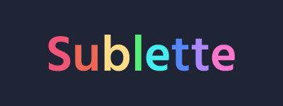
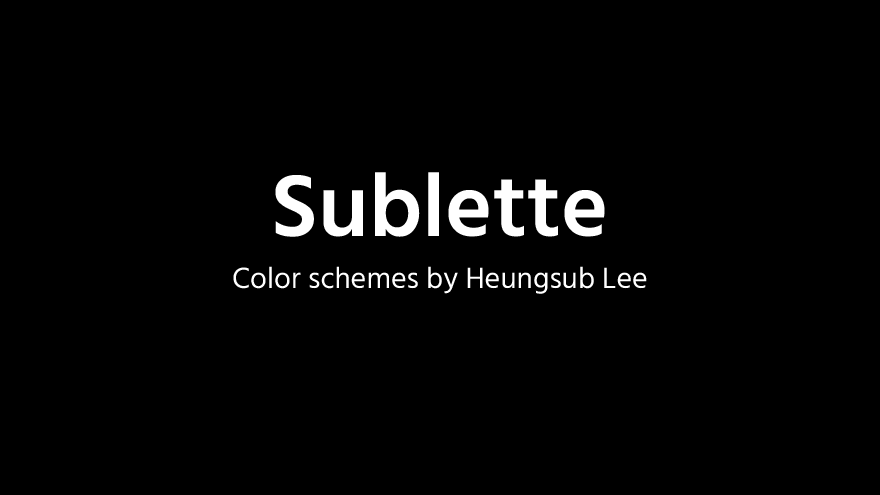
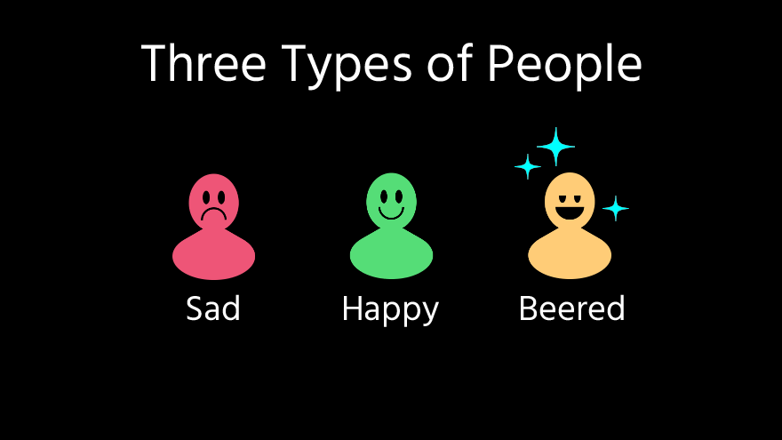
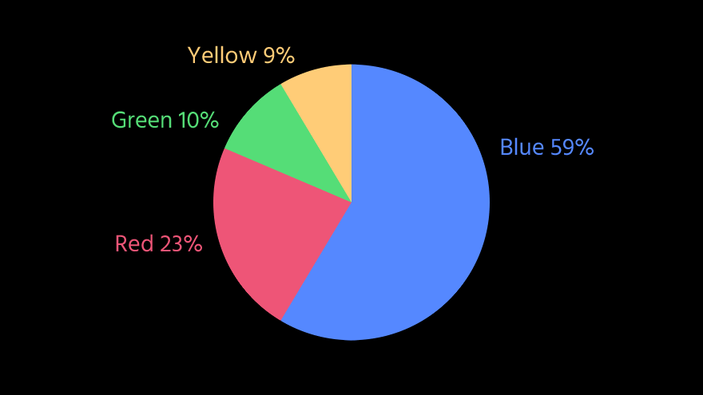

# Sublette

I've always loved coloring. Now it's time to design my color schemes.

## For Terminal (base)

Color          | Hex       | RGB                  | HSL                   |🎨
-------------- | --------- | -------------------- | --------------------- | --------------------------
Foreground     | `#ccced0` | `rgb(204, 206, 208)` | `hsl(210, 2%, 82%)`   | 
Background     | `#202535` | `rgb(32, 37, 53)`    | `hsl(226, 40%, 21%)`  | 
Black          | `#253045` | `rgb(37, 48, 69)`    | `hsl(219, 46%, 27%)`  | 
Red            | `#e57`    | `rgb(238, 85, 119)`  | `hsl(347, 64%, 93%)`  | 
Green          | `#5e7`    | `rgb(85, 238, 119)`  | `hsl(133, 64%, 93%)`  | 
Yellow         | `#fd8`    | `rgb(255, 221, 136)` | `hsl(43, 47%, 100%)`  | 
Blue           | `#58f`    | `rgb(85, 136, 255)`  | `hsl(222, 67%, 100%)` | 
Magenta        | `#f7c`    | `rgb(255, 119, 204)` | `hsl(322, 53%, 100%)` | 
Cyan           | `#4ee`    | `rgb(68, 238, 238)`  | `hsl(180, 71%, 93%)`  | 
White          | `#f5f5da` | `rgb(245, 245, 218)` | `hsl(60, 11%, 96%)`   | 
Bright Black   | `#405570` | `rgb(64, 85, 112)`   | `hsl(214, 43%, 44%)`  | 
Bright Red     | `#e65`    | `rgb(238, 102, 85)`  | `hsl(7, 64%, 93%)`    | 
Bright Green   | `#9e7`    | `rgb(153, 238, 119)` | `hsl(103, 50%, 93%)`  | 
Bright Yellow  | `#ff7`    | `rgb(255, 255, 119)` | `hsl(60, 53%, 100%)`  | 
Bright Blue    | `#7bf`    | `rgb(119, 187, 255)` | `hsl(210, 53%, 100%)` | 
Bright Magenta | `#a8f`    | `rgb(170, 136, 255)` | `hsl(257, 47%, 100%)` | 
Bright Cyan    | `#5fb`    | `rgb(85, 255, 187)`  | `hsl(156, 67%, 100%)` | 
Bright White   | `#ffe`    | `rgb(255, 255, 238)` | `hsl(60, 7%, 100%)`   | 

Use "Foreground" and "Background" for the cursor and cursor text respectively.

### Showcase

## For Slides

The purpose of a color scheme for Terminal and Slides is different. I need only
4 grayscale colors for text and background, and 6 hues--Blue, Red, Green,
Yellow, Violet, Teal--for clear semantics.

I prefer Black as the background color on projection screens to erase the
bezel. Also, I prefer White as the text color for the best readability.

The brightness of 6 hues should be normalized to be recognized at the same
level. If they are not, some hues look like more important than other hues. By
the way, some colors in the terminal color scheme are slightly brighter than
other colors. Here I adjust them for brightness normalization.

Color               | Hex       | RGB                  | HSL                   |🎨
------------------- | --------- | -------------------- | --------------------- | ---------------------------------
Slides Foreground   | `#fff`    | `rgb(255, 255, 255)` | `hsl(0, 0%, 100%)`    | 
Slides Foreground 2 | `#808080` | `rgb(128, 128, 128)` | `hsl(0, 0%, 50%)`     | 
Slides Foreground 3 | `#404040` | `rgb(64, 64, 64)`    | `hsl(0, 0%, 25%)`     | 
Slides Background   | `#000`    | `rgb(0, 0, 0)`       | `hsl(0, 0%, 0%)`      | 
Slides Blue         | `#58f`    | `rgb(85, 136, 255)`  | `hsl(222, 67%, 100%)` | 
Slides Red          | `#e57`    | `rgb(238, 85, 119)`  | `hsl(347, 64%, 93%)`  | 
Slides Green        | `#5d7`    | `rgb(85, 221, 119)`  | `hsl(135, 62%, 87%)`  | 
Slides Yellow       | `#fc7`    | `rgb(255, 204, 119)` | `hsl(37, 53%, 100%)`  | 
Slides Violet       | `#a8f`    | `rgb(170, 136, 255)` | `hsl(257, 47%, 100%)` | 
Slides Teal         | `#4dd`    | `rgb(68, 221, 221)`  | `hsl(180, 69%, 87%)`  | 

Use "Slides Foreground" for the link but with underline.

### Showcase

