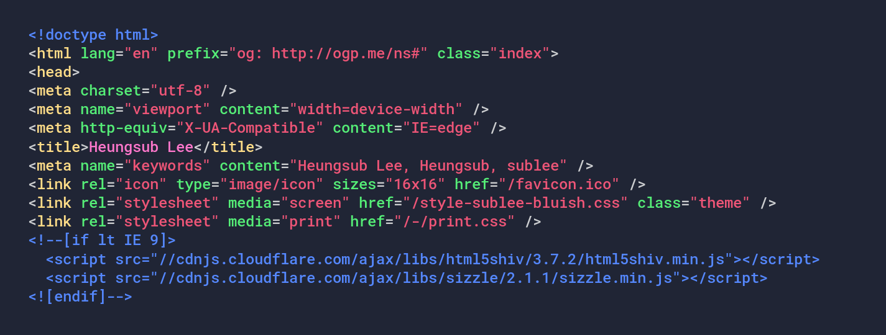

# Sublette

A terminal color scheme.

Color          | Hex       | RGB                  | HSL                   |🎨
-------------- | --------- | -------------------- | --------------------- | --------------------------
Foreground     | `#ccced0` | `rgb(204, 206, 208)` | `hsl(210, 2%, 82%)`   | 
Background     | `#202535` | `rgb(32, 37, 53)`    | `hsl(226, 40%, 21%)`  | 
Black          | `#253045` | `rgb(37, 48, 69)`    | `hsl(219, 46%, 27%)`  | 
Red            | `#e57`    | `rgb(238, 85, 119)`  | `hsl(347, 64%, 93%)`  | 
Green          | `#5e7`    | `rgb(85, 238, 119)`  | `hsl(133, 64%, 93%)`  | 
Yellow         | `#fd8`    | `rgb(255, 221, 136)` | `hsl(43, 47%, 100%)`  | 
Blue           | `#58f`    | `rgb(85, 136, 255)`  | `hsl(222, 67%, 100%)` | 
Magenta        | `#f7c`    | `rgb(255, 119, 204)` | `hsl(322, 53%, 100%)` | 
Cyan           | `#4ee`    | `rgb(68, 238, 238)`  | `hsl(180, 71%, 93%)`  | 
White          | `#f5f5da` | `rgb(245, 245, 218)` | `hsl(60, 11%, 96%)`   | 
Bright Black   | `#405570` | `rgb(64, 85, 112)`   | `hsl(214, 43%, 44%)`  | 
Bright Red     | `#e65`    | `rgb(238, 102, 85)`  | `hsl(7, 64%, 93%)`    | 
Bright Green   | `#9e7`    | `rgb(153, 238, 119)` | `hsl(103, 50%, 93%)`  | 
Bright Yellow  | `#ff7`    | `rgb(255, 255, 119)` | `hsl(60, 53%, 100%)`  | 
Bright Blue    | `#7bf`    | `rgb(119, 187, 255)` | `hsl(210, 53%, 100%)` | 
Bright Magenta | `#a8f`    | `rgb(170, 136, 255)` | `hsl(257, 47%, 100%)` | 
Bright Cyan    | `#5fb`    | `rgb(85, 255, 187)`  | `hsl(156, 67%, 100%)` | 
Bright White   | `#ffe`    | `rgb(255, 255, 238)` | `hsl(60, 7%, 100%)`   | 

Use "Foreground" and "Background" for the cursor and cursor text respectively.

## Showcase

